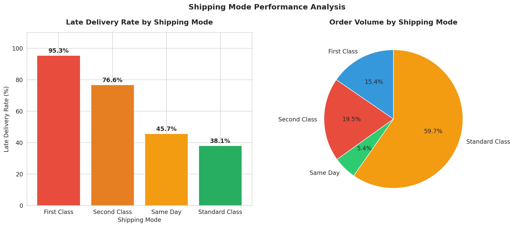
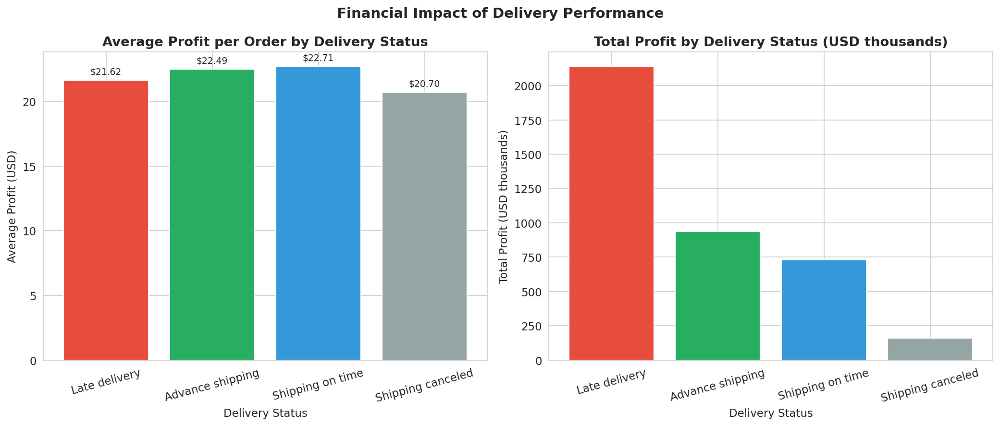
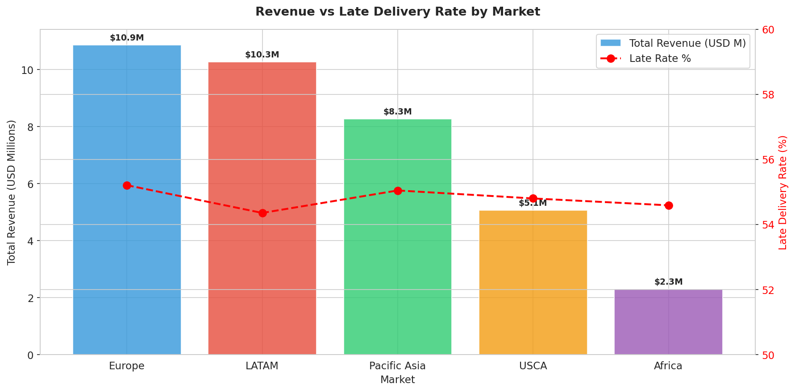
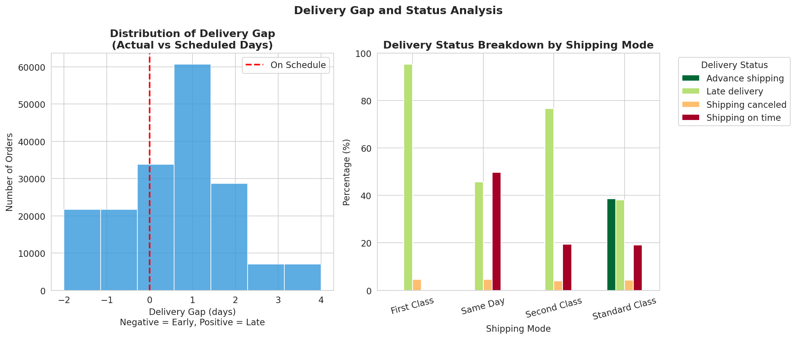
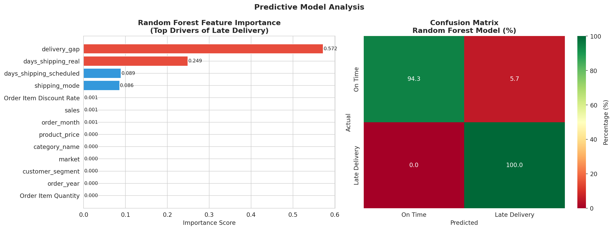

# Supply Chain Performance Intelligence

> Identifying delivery bottlenecks, quantifying financial impact, and predicting late shipment risk across a global supply chain operation.

[](https://www.python.org/)
[](https://www.sqlite.org/)
[](https://public.tableau.com/app/profile/phu.qui.dang)
[](https://scikit-learn.org/)

**[View the Interactive Tableau Dashboard](https://public.tableau.com/app/profile/phu.qui.dang/viz/SupplyChainPerformanceIntelligence/SupplyChainPerformanceIntelligenceDashboard)**



---

## Table of Contents

1. [Business Problem](#business-problem)
2. [Key Findings](#key-findings)
3. [Recommendations](#recommendations)
4. [Dataset](#dataset)
5. [Technical Approach](#technical-approach)
6. [Model Performance](#model-performance)
7. [Visualisations](#visualisations)
8. [Tech Stack](#tech-stack)
9. [Repository Structure](#repository-structure)
10. [About](#about)

---

## Business Problem

More than half of all orders in this supply chain are delivered late, yet the business continues to offer delivery windows that operations cannot reliably meet. This project investigates where delivery failures occur, which shipping modes and markets are most affected, and what the financial cost of these failures is to the business.

Three core business questions guide the analysis:

1. Which shipping modes and product categories carry the highest late delivery rate, and what is the financial impact on the business?
2. Which customer markets generate the most revenue but experience the worst delivery performance?
3. Can late deliveries be predicted before shipment, and what operational factors drive the risk?

---

## Key Findings

**Finding 1: First Class shipping carries a 95.3% late delivery rate**

First Class, the most expensive delivery option, has the highest late delivery rate across all shipping modes. The root cause is an unrealistic 1-day scheduled delivery window that operations cannot consistently meet. Customers paying a premium for speed receive the worst delivery experience, directly undermining customer trust and brand reputation.

**Finding 2: Late delivery is a systemic operational issue, not a regional one**

Late delivery rates are consistent across all five global markets, ranging from 54.3% to 55.2%. No single market or region is underperforming in isolation. The scheduling process itself is the root cause, and it affects the entire supply chain equally.

**Finding 3: Late deliveries cost the business approximately $77,000 in avoidable profit loss**

Late deliveries generate $0.78 less profit per order compared to on-time deliveries. With 98,977 late orders recorded, this represents approximately $77,000 in profit that could be recovered through improved scheduling accuracy alone.

---

## Recommendations

**Recommendation 1: Revise First Class delivery scheduling**

Extend the First Class scheduled delivery window from 1 day to a minimum of 2 to 3 days to reflect actual operational capacity. This single change would immediately reduce the 95.3% late delivery rate for First Class customers and realign expectations with realistic delivery timelines.

**Recommendation 2: Conduct a company-wide scheduling audit**

Commission a full review of delivery scheduling processes across all shipping modes and markets. Given that late delivery rates are consistent across all five global markets, the root cause is systemic rather than regional. The audit should identify where scheduled windows are miscalibrated and establish delivery commitments that operations can reliably meet.

**Recommendation 3: Implement a targeted profit recovery program**

Prioritise operational improvements beginning with Standard Class, the highest volume mode at 107,752 orders. Each percentage point improvement in on-time delivery rate recovers approximately $770 in annual profit. A 10% improvement across all modes would recover approximately $7,700 in avoidable losses.

---

## Dataset

| Attribute | Detail |
|---|---|
| Source | [DataCo Smart Supply Chain Dataset](https://www.kaggle.com/datasets/shashwatwork/dataco-smart-supply-chain-for-big-data-analysis) via Kaggle |
| Size | 180,519 orders across 53 features |
| Period | 2015 to 2018 |
| Scope | Global supply chain across 5 markets: Europe, LATAM, Pacific Asia, USCA, Africa |

---

## Technical Approach

### Phase 1: Data Understanding

Reviewed 180,519 transaction records across 53 columns. Identified two critical data quality issues: Product Description was 100% missing and Order Zipcode was 86% missing. All cleaning decisions were documented with business justification before any analysis began.

### Phase 2: Data Cleaning

- Removed 9 irrelevant columns including personal identifiers and fields with excessive missing data
- Converted date columns from object type to datetime format
- Engineered a new feature, Delivery Gap, calculated as actual shipping days minus scheduled shipping days
- Extracted time-based features: order year, month, and quarter
- Result: a clean dataset with zero missing values across 50 columns and 180,519 rows

### Phase 3: SQL Analysis

Loaded the clean dataset into a SQLite database and executed structured queries to answer each business question. Queries covered late delivery rate by shipping mode, revenue and profit by market, and delivery gap patterns by shipping mode and scheduled window length.

### Phase 4: Exploratory Data Analysis

Conducted univariate and bivariate analysis across all key variables. The most significant finding was counterintuitive: First Class, the premium shipping option, carries the highest late delivery rate of any mode. This is caused by an unrealistic 1-day scheduled window rather than operational failure. Market-level analysis confirmed that late delivery patterns are systemic rather than regional.

### Phase 5: Predictive Modelling

Trained and compared two classification models to predict late delivery risk before shipment. See [Model Performance](#model-performance) below for full results.

**Note on model limitations:** The two highest-importance features, delivery gap and actual shipping days, are only known after delivery has occurred. In a production environment, the model should be retrained using only pre-shipment features such as shipping mode and scheduled days. The current model is best suited to retrospective analysis and insight generation rather than real-time prediction.

### Phase 6: Dashboard

Built a four-panel interactive Tableau Public dashboard with three KPI summary cards. The dashboard covers shipping mode performance, market revenue versus late delivery rate, delivery gap distribution, and financial impact by delivery status.

---

## Model Performance

| Model | AUC Score | Accuracy |
|---|---|---|
| Logistic Regression (baseline) | 0.9725 | 97% |
| Random Forest (final) | 0.9758 | 97% |

Random Forest was selected as the final model based on a marginally higher AUC score. The top four predictive features were delivery gap, actual shipping days, scheduled shipping days, and shipping mode.

---

## Visualisations

### Late Delivery Rate by Shipping Mode


### Financial Impact of Delivery Performance


### Revenue vs Late Delivery Rate by Market


### Delivery Gap Distribution


### Predictive Model Results


---

## Tech Stack

| Category | Tools |
|---|---|
| Data Cleaning and Analysis | Python, pandas, numpy |
| Visualisation | matplotlib, seaborn, Tableau Public |
| Database | SQL, SQLite |
| Machine Learning | scikit-learn, Logistic Regression, Random Forest |
| Environment | Google Colab, GitHub |

---

## Repository Structure

```
supply-chain-performance-analysis/
├── README.md
├── data/
│   └── supply_chain_clean.csv
├── notebooks/
│   └── supply_chain_analysis.ipynb
├── images/
│   ├── chart1_shipping_mode.png
│   ├── chart2_financial_impact.png
│   ├── chart3_market_analysis.png
│   ├── chart4_delivery_gap.png
│   └── chart5_model_results.png
└── sql/
    └── analysis_queries.sql
```

---

## About

**Phu Qui (Will) Dang**

Supply Chain and Data Analytics Graduate

Bachelor of Business in Logistics and Supply Chain Management, Swinburne University of Technology

Master of Business Analytics (Data Science), La Trobe University

[LinkedIn](https://linkedin.com/in/phuquidang) | [Tableau Public](https://public.tableau.com/app/profile/phu.qui.dang) | [GitHub](https://github.com/dangquii)
